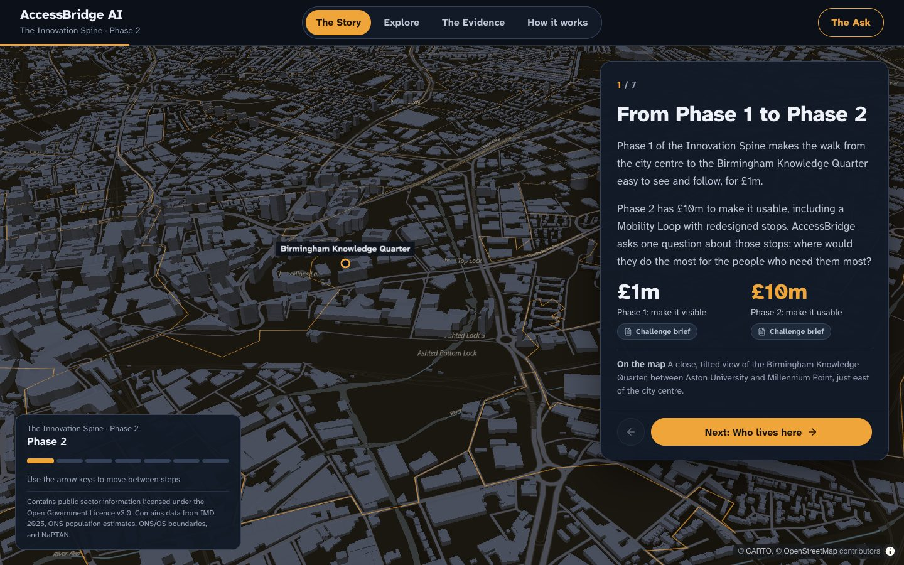
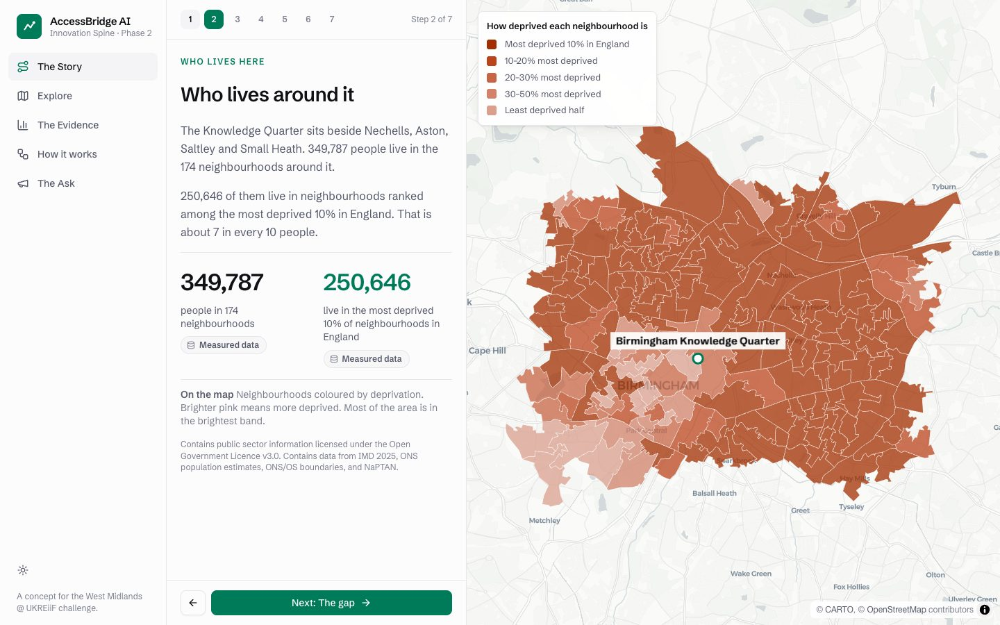
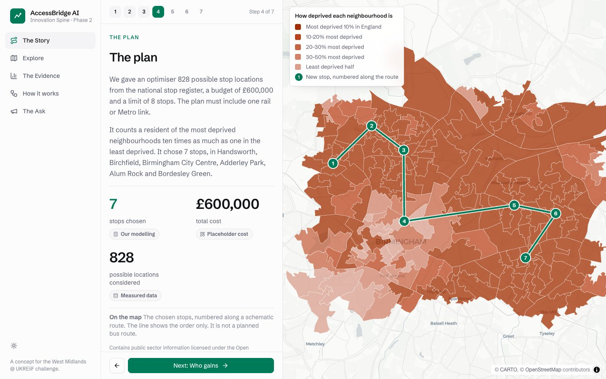
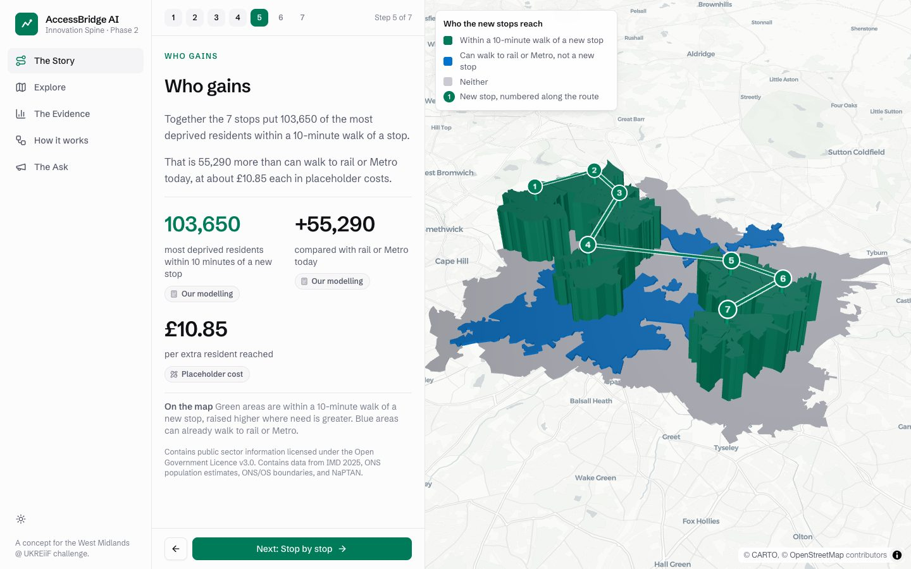
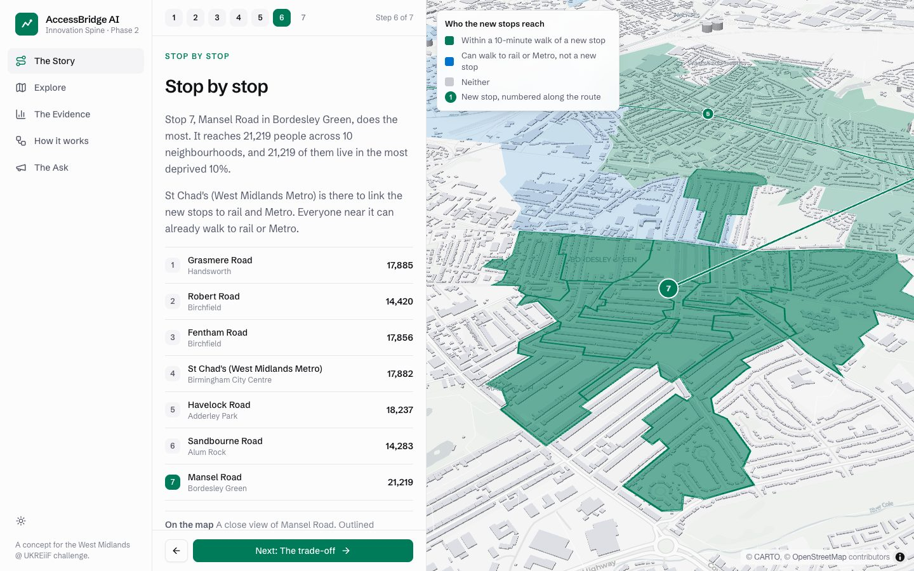
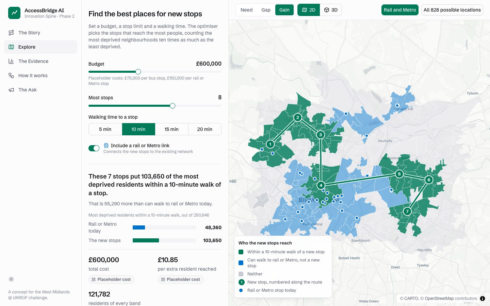

# AccessBridge AI

**An equity-first transit accessibility prototype for the Birmingham Knowledge Quarter.**

AccessBridge AI helps explore where a small feeder-stop network could improve
access for residents in highly deprived Birmingham neighbourhoods near the
Knowledge Quarter, Eastside, Nechells, Aston, and the wider central/east
Birmingham study area.

> Independent portfolio project responding to the *West Midlands @ UKREiiF -
> Next-Gen Placemaking & Urban Design Challenge*. Not an official output of the
> Birmingham Knowledge Quarter or its partners.

## Current Phase 2 demo

The implemented Phase 2 product is:

- A reproducible Stage 0 data pipeline using IMD 2025, ONS population,
  Birmingham LSOA boundaries, and NaPTAN stops.
- A proxy accessibility engine using LSOA centroids and candidate-stop walking
  distance.
- A Stage 7 travel-time matrix routed with R5 on the OpenStreetMap street
  network, built by `scripts/build_r5_matrix.py` from a pinned Geofabrik
  extract and the Bus Open Data Service West Midlands GTFS feed. A
  walk-plus-transit matrix from the same build is saved beside it.
- A single-objective PuLP/CBC MILP optimiser that maximises equity-weighted
  covered population.
- Plain place names for every neighbourhood and stop, derived from NaPTAN
  localities, so the site says "Birchfield" rather than "Birmingham 033E".
- A FastAPI backend with `GET /scenario`, `POST /optimise` and `GET /evidence`.
- A React + TypeScript site framed as Phase 2 of the Innovation Spine, with five
  sections:
  - **The Story**: a seven-step guided walk-through on the map, from Phase 1 to
    the trade-offs.
  - **Explore**: live budget, stop-limit and walking-time controls, with a card
    for every chosen stop showing who it reaches.
  - **The Evidence**: labelled charts and tables for need, today's gap, gains
    by deprivation band, budget and walking-time sensitivity, and value for
    money.
  - **How it works**: the method in four plain steps, its limits and data
    licences.
  - **The Ask**: the three Spine phases, where the stops sit in the £10m, and
    next steps.
- A 2D/3D MapLibre + deck.gl map with need, gap and gain modes, numbered stops,
  a schematic route, highlighted catchments and street-level 3D buildings.
- Light and dark themes, following the reader's system setting with a toggle in
  the header. The basemap and every data colour change with the theme.
- Every figure is labelled as measured data, our modelling, a placeholder cost
  or a challenge-brief figure.
- A reproducible Phase 2 evaluation script.

Walking times are routed along real streets at 80 metres a minute. Bus and
Metro legs are not part of the active matrix, so a stop counts as reached only
on foot; the transit profile is one flag away. Stop costs are placeholders.

## Why this exists

The Birmingham Knowledge Quarter sits beside some of the city's most deprived
wards, including Nechells and Aston, while major roads and weak public realm can
make access uneven. A new transit or feeder-stop pattern should not only connect
places; it should make clear who benefits.

AccessBridge AI frames that as an optimisation problem: given real deprivation
and population geography, candidate transport access nodes, a stop-count limit,
and a budget, choose the stop pattern that maximises equity-weighted access and
show the trade-offs transparently.

## Headline Phase 2 result

Default request:

- Budget: GBP 600,000
- Maximum stops: 8
- Catchment threshold: 10 proxy walking minutes
- Interchange required: yes

Default optimiser result:

- Selected stops: 7
- Total cost: GBP 600,000
- Most-deprived-decile residents reached: 103,650 vs 48,360 baseline
- Most-deprived-decile resident gain: 55,290
- Total population reached: 121,782 vs 101,367 baseline

See [`EVALUATION.md`](EVALUATION.md) for the full decile breakdown and
sensitivity checks.

## Screenshots

| | |
|---|---|
|  |  |
|  |  |
|  |  |

All 15 screenshots are in [`docs/screenshots/`](docs/screenshots/), including
dark-mode views. The shell is a left sidebar with the map pages laid out as
content and map columns. Regenerate them with `npm run screenshots` in `frontend/`. A timed two-minute pitch script
is in [`docs/WALKTHROUGH.md`](docs/WALKTHROUGH.md), and the visual system is
described in [`DESIGN.md`](DESIGN.md).

## Running locally

```bash
# 1. Python environment
/usr/bin/python3 -m venv .venv
source .venv/bin/activate
python -m pip install --upgrade pip
python -m pip install -r requirements-dev.txt

# 2. Data pipeline, if processed files are missing
python scripts/fetch_data.py
python scripts/build_stage0_geography.py
python scripts/build_stage0_stops.py
python scripts/build_stage0_accessibility.py
python scripts/build_stage7_travel_time_matrix.py     # straight-line proxy matrix
python scripts/build_place_names.py

# 2b. Optional: route real walking times with R5 (needs ~10 minutes and 250 MB)
#     uv creates a Python 3.12 environment; a JDK 21 is unpacked into .jdk/
uv venv .venv-routing --python 3.12 && uv pip install --python .venv-routing/bin/python r5py
mkdir -p .jdk && curl -sL https://api.adoptium.net/v3/binary/latest/21/ga/mac/aarch64/jdk/hotspot/normal/eclipse | tar -xz -C .jdk
curl -sL -o data/external/gtfs_west_midlands_bods.zip https://data.bus-data.dft.gov.uk/timetable/download/gtfs-file/west_midlands/
curl -sL -o data/external/west-midlands-latest.osm.pbf https://download.geofabrik.de/europe/united-kingdom/england/west-midlands-latest.osm.pbf
JAVA_HOME=$(ls -d .jdk/jdk-21*/Contents/Home) .venv-routing/bin/python scripts/build_r5_matrix.py
python scripts/build_stage7_travel_time_matrix.py --r5-input data/processed/r5_walk_matrix.csv \
  --routing-source r5 --routing-profile walk
python scripts/write_evaluation.py

# 3. Backend API
.venv/bin/uvicorn app.main:app --host 127.0.0.1 --port 8000

# 4. Frontend dashboard
cd frontend
npm install
npm run dev
```

Open:

- Frontend: `http://127.0.0.1:5173/`
- Production build: `npm run build && npm run preview`, then `http://127.0.0.1:4173/`
- API docs: `http://127.0.0.1:8000/docs`
- Health: `http://127.0.0.1:8000/health`

## Verification commands

```bash
.venv/bin/python -m pytest
.venv/bin/python -m ruff check app tests scripts
.venv/bin/python -m mypy app tests
PYTHONPYCACHEPREFIX=.pycache-check .venv/bin/python -m compileall -q app tests scripts

cd frontend
npm run build
npm run test:e2e      # 24 browser tests; starts the API and site if needed
npm run screenshots   # refreshes docs/screenshots
```

The browser tests use the installed Google Chrome. Without it, run
`npx playwright install chromium` and set `PW_CHANNEL=chromium`.

Regenerate the evaluation and `EVALUATION.md`:

```bash
.venv/bin/python scripts/write_evaluation.py
```

## Deploying

The site runs as static files from a precomputed API snapshot, so it can be
hosted on GitHub Pages with no server, or as one container with a live API.
See [`docs/DEPLOY.md`](docs/DEPLOY.md).

## API

`GET /scenario` returns:

- Study-area LSOA GeoJSON, with a `place_name` on every neighbourhood
- Candidate-stop GeoJSON, with a `place_name` on every stop
- Baseline travel-time accessibility metric
- Default optimisation request and study-area bounds
- Attribution and method caveat text

`POST /optimise` accepts:

```json
{
  "budget_gbp": 600000,
  "max_stops": 8,
  "threshold_min": 10,
  "require_interchange": true
}
```

It returns selected stops, covered origins, cost, objective value, baseline vs
optimised accessibility metrics, decile deltas, route GeoJSON, and a
deterministic explanation. `stop_details` lists the stops in route order with
the people each one reaches, how many are in the most deprived 10%, how many
cannot walk to rail or Metro today, and every neighbourhood within reach.

`GET /evidence` returns study-area facts, the default plan with stop details,
the cost per extra most-deprived resident, and budget and walking-time
sensitivity sweeps. It is computed once, cached until an input file changes,
and warmed in the background when the API starts.

## Project structure

```text
accessbridge-ai/
├── app/                 # FastAPI backend
│   ├── accessibility/   # Proxy and travel-time accessibility engines
│   ├── api/             # HTTP routes
│   ├── data/            # Local artifact registry
│   ├── optimisation/    # PuLP/CBC MILP optimiser
│   ├── evidence.py      # Cached evidence payload and sensitivity sweeps
│   ├── geometry.py      # GeoJSON helpers and route ordering
│   ├── insights.py      # Per-stop reach details
│   ├── places.py        # Place-name lookup
│   ├── config.py
│   ├── schemas.py
│   └── main.py
├── frontend/            # React, Vite, MapLibre, deck.gl site
├── data/                # Local raw/processed data, gitignored
├── notebooks/           # Discovery/evidence notebooks
├── scripts/             # Fetch, build, and evaluation scripts
├── tests/               # Backend tests
├── docs/                # Screenshots and the pitch walkthrough
├── PRODUCT.md           # Users, purpose and design principles
├── DESIGN.md            # Colour, type, components and motion
├── PROJECT_STAGES.md
├── EVALUATION.md
├── METHODOLOGY.md
└── DATA.md
```

## Tech stack

| Layer | Implemented now |
|---|---|
| Data processing | `pandas`, `GeoPandas`, `Shapely`, `pyogrio` |
| Accessibility | Stage 7 travel-time matrix, routed with R5 (r5py, JDK 21) on OpenStreetMap streets |
| Optimisation | `PuLP` with CBC MILP solver |
| API | `FastAPI`, `Pydantic` |
| Frontend | `React 19`, `TypeScript`, `Vite`, `Tailwind CSS v4`, `shadcn/ui` on Radix, `motion`, `deck.gl`, `MapLibre GL JS`, `lucide-react`, `Schibsted Grotesk`; light and dark themes, green identity with a validated colour-blind-safe map palette |
| Testing/tooling | `pytest`, `ruff`, `mypy`, TypeScript build, Playwright browser tests |

Planned later:

- A walk-plus-transit reach view from the R5 matrix already produced
- NSGA-II / Pareto front
- Demand model and SHAP explanations
- Natural-language control layer
- Deployment and walkthrough video

## Data and licences

Built on open data: IMD 2025, ONS population, Birmingham LSOA boundaries, and
NaPTAN for the current Phase 2 demo. See [`DATA.md`](DATA.md) for source and
licence details.

Attribution to display:

- Contains public sector information licensed under the Open Government Licence
  v3.0.
- Contains data from IMD 2025, ONS population estimates, ONS/OS boundaries, and
  NaPTAN.
- Map data © OpenStreetMap contributors, available under the ODbL.

## Limitations

This is a decision-support prototype, not a transport business case. Current
costs are scenario placeholders, current travel times are a proxy, and selected
routes are schematic connectors through selected stops rather than operator
timetables. The tool identifies where access could improve under explicit
assumptions; it does not replace consultation, detailed traffic modelling, or
operator planning.

## Acknowledgements

Created as an independent project inspired by *The Innovation Spine*, the
winning entry to the West Midlands @ UKREiiF Next-Gen Placemaking & Urban Design
Challenge. The original proposal was a team effort; this engineering work and
documentation are my own.
